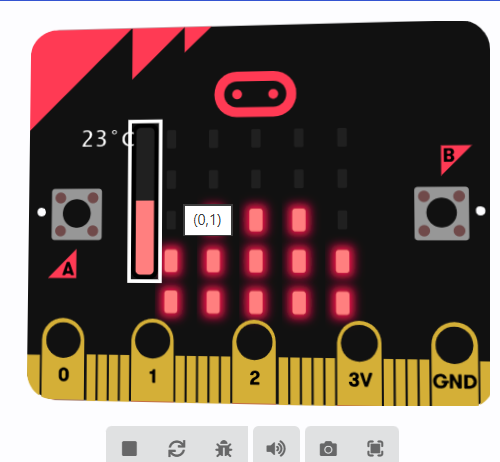

# Proyecto Micro:bit — Gráfico de temperatura y gota móvil

## Descripción

Este proyecto implementa dos funciones principales en un mismo Micro:bit:

1. **Gráfico de barras de temperatura**  
   - Muestra un gráfico de barras en la matriz de LEDs que representa la temperatura actual.  
   - La escala máxima está fijada en 50°C.  
   - La función se ejecuta continuamente.

2. **Gota móvil**  
   - Una gota representada por un único LED se mueve por la matriz según la inclinación de la Micro:bit.  
   - La lectura del acelerómetro determina el movimiento en los ejes X e Y.  
   - La función se ejecuta continuamente junto con el gráfico de temperatura, por lo que ambas se pueden ver simultáneamente.

> En el simulador de MakeCode, puedes mover el ratón sobre la Micro:bit virtual para simular la inclinación y ver cómo se mueve la gota.

---

## **Captura**

